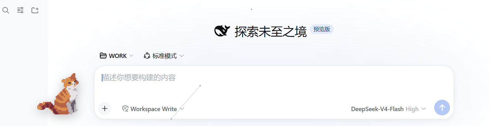

# 🐱 toto-the-cat — Desktop Pet Plugin for DeepSeek Harness

[中文](./README.md) | English

   

A desktop pet named **Toto** living inside the DeepSeek Harness web UI. Its
look is entirely defined by custom images in `assets/` (transparent PNGs — a
still `idle.png` or a frame sequence `idle-0.png`, `idle-1.png`, ...). With no
images, Toto is not displayed. Zero dependencies, zero build step — installs
like a skin.

![Drop images into assets/ to define Toto's look; nothing shows without them]

## Screenshot



## Features

- **Frame animation**: continuous `idle-N.png` frames loop at ~4 fps by default
  (240 ms/frame, adjustable in Settings); a single `idle.png` renders still
- **Draggable**: grab Toto and move it anywhere; position persists (localStorage)
- **Quiet like a cat**: Toto never talks — it just keeps you company
- **Pomodoro**: click Toto to show the text entry (click again to hide); the
  panel opens beside it with focus/break timers. Finishing a focus session
  grants XP (1 XP per minute) and auto-starts a 5-min break
- **30 Facts about Toto**: a separate entry alongside the Pomodoro; each fact
  has a title and content, the module lists titles only and expands on click,
  locked ones show ???; level-ups remind you a new fact is available; progress
  is persisted host-side, shared across browsers
- **Close button**: × on the pet hides it instantly (the × is hidden by
  default, appears on interaction and auto-hides after 2.5 s of idle); while
  hidden a persistent "wake pill" sits at the bottom-right (click to restore),
  or reopen via Settings
- **Compact footprint**: ~180×225 px by default, drag/scale without blocking
- **Settings page** (Settings → Toto Pet): visibility, size, animations, speed,
  pixel rendering
- **zh/en labels** follow the DSH locale
- **Accessible**: respects the system `prefers-reduced-motion` setting

## Directory structure

```
totoTheCat/
├── package.json        # plugin manifest: dsh.bundle.patch + dsh.client.platform=web
├── cordis.patch.yml    # patch layer that mounts this package as a profile row
├── index.js            # host (Node) half — assets static route + /state progress route
├── client.js           # browser half — Toto + pomodoro/levels/30 facts
├── assets/             # appearance assets + facts document (shipped)
│   ├── idle-0.png…     # sample frame animation
│   └── 有关托托的30个事实.md
├── tools/
│   └── slice-frames.ps1 # strip-to-frames slicing tool
├── dev/                # development files (artist source / old backups, not shipped)
├── README.md           # this document (中文)
└── README.en.md
```

## How the DSH plugin mechanism works (30-second intro)

- DSH is a **profile launcher**. A profile is an ordered stack of
  plugin-bundle patch layers, declared in
  `$DSH_HOME/profiles/<name>/package.json` under `dsh.profile.bundles`.
- **A plugin is a plain npm package.** As long as its `package.json` declares
  `dsh.bundle.patch`, `dsh plugin` automatically adds it to the profile's
  layer stack after install; the patch file (`cordis.patch.yml`) is composed
  into the Cordis config at profile startup.
- The browser half is declared via `dsh.client.platform: "web"` +
  `exports["./client"]`, loaded by the `dsh-client-modules` service, and mounts
  UI through **Slots** (e.g. `shell.overlay`, `settings.section`).
- Both halves are **plain JS function bodies** (no TS, no JSX, no build).

> This repository also serves as a complete, copyable minimal plugin
> template. Reference implementation: the `cyber-particle` plugin already
> installed in dsh's web profile (particle background) — this plugin follows
> the same structure.

## Install

### Method 1: Registry (after publishing to npm)

```sh
dsh plugin --profile web add toto-the-cat
dsh web        # restart the web service to activate the new bundle
```

### Method 2: Dev mode (edits apply live via link)

With the `link:` protocol, the profile's `node_modules` holds a link to this
repo, so code changes take effect after restarting `dsh web` — no repeated
reinstalls:

```sh
cd D:\WORK\Project\totoTheCat
dsh plugin --profile web add link:D:\WORK\Project\totoTheCat
dsh web
```

### Method 3: Local directory

```sh
dsh plugin --profile web add D:\WORK\Project\totoTheCat
dsh web
```

### Uninstall

```sh
dsh plugin --profile web remove toto-the-cat
dsh web
```

> Uninstalling does **not** delete the progress file
> `$DSH_HOME/toto-the-cat-state.json` — progress survives a reinstall (delete
> the file manually to fully reset).

## Requirements

- **Runtime**: the **web profile** of DeepSeek Harness (`dsh web`). The host
  half depends on the `webServer` service, the browser half on the
  `shell.overlay` / `settings.section` slots; other profiles (e.g. headless)
  are unaffected.
- **Restart `dsh web` after install/update**: bundle layers compose at boot.
- **Writable directory**: progress is written to
  `$DSH_HOME/toto-the-cat-state.json` (falls back to `~/.dsh` when `DSH_HOME`
  is unset).
- **No runtime dependencies**: no npm packages; the browser side uses only
  standard Web APIs.
- **Browsers**: Chromium engines (Chrome / Edge) verified; no private APIs.
- **Default appearance**: ships 4 example frames (`assets/idle-0..3.png`);
  replacing the look is covered under [Custom appearance](#custom-appearance).

## Development loop

1. Edit `client.js` (browser side) or `index.js` (host side);
2. Syntax-check with `node --check client.js`;
3. Restart `dsh web` (or let DSH's HMR pick it up) and observe.

> Tip: `dsh plugin add` runs pnpm and **automatically** writes the package
> name into `dsh.profile.bundles` (by checking the `dsh.bundle` declaration) —
> no manual profile editing.

## Custom appearance

Toto has no built-in look — its appearance is fully determined by images you
place in `assets/`: no images means no Toto (the settings page explains why).
Put the following resources in `assets/`:

| Use | File | Notes |
| --- | --- | --- |
| Single still | `assets/idle.png` | static display |
| Frame animation (recommended) | `assets/idle-0.png`, `idle-1.png`, … | ~4 fps loop by default (speed adjustable in Settings) |

- **Format**: PNG with alpha. Auto-detection **only recognizes `.png`
  filenames**; WebP/JPG etc. are not detected
- **Aspect**: 4:5 (width:height), display container 200×250, ~180×225 px by
  default; pixel art recommended at integer multiples (360×450 / 720×900),
  with "pixel rendering" on by default for crispness
- **Animation**: up to 16 frames, 4–8 frame loops work best; all frames must
  be identical in size
- **Apply**: restart `dsh web` after adding files; deleting the files hides
  Toto again. Resources are served by the host route
  `/toto-the-cat/assets/*` and auto-detected at browser startup; nothing is
  shown while detection is in progress.

## Pomodoro & growth (entry lives on Toto)

- **Entry cluster**: clicking Toto shows two text entries — "Pomodoro" and
  "30 Facts about Toto" (click Toto again to hide); **clicking an entry title
  toggles its panel** (no × buttons). Panels always open on the emptier side
  of the screen (compares the free space above/below Toto — above when Toto
  sits low, below when high) and follow Toto when dragged. While a session
  runs, the entry shows "Focus 24:31 / Break 04:59"
- **Timer**: focus length = presets (5/10/15/30/45/60 min) + custom
  (1–120 min via slider or manual input, choice remembered); after finishing
  it auto-starts a 5-min break, then returns to idle
- **XP**: finishing a focus session grants `work minutes × 1` XP; progress is
  persisted host-side to `$DSH_HOME/toto-the-cat-state.json`, shared across
  Chrome / Edge / multiple tabs
- **Levels**: the first three level-ups (to levels 2/3/4) each need just 10 XP
  — **the first three levels unlock within 30 minutes** (two 15-minute focus
  sessions); afterwards needs grow slowly (+1 XP every 5 levels).
  Cumulative: L2=10, L3=20, L4=30, L5=40, L9=81, L15=149, **L30=350**
- **Pacing**: 350 XP unlocks all content in ≈ **6 hours of focus** (15/30/45/60
  min sessions are exactly 6 h; 25-min sessions ≈ 5 h 50 min)
- **30 Facts about Toto**: content is loaded and parsed at runtime from
  **`assets/有关托托的30个事实.md`** (format `1. title: content`; edits apply
  on refresh, no code change). Each fact has **title + content**; the module
  lists titles only and expands on click; locked ones show ??? (fact #N
  unlocks at level N+1). **Fact #30 and the "Author's note" unlock together at
  level 30.** A toast at the bottom reminds you which fact was unlocked on
  level-up. Falls back to placeholders if the document is missing or fails to
  parse.

## Settings (Settings → Toto Pet)

| Setting | Default | Notes |
| --- | --- | --- |
| Show Toto | on | show/hide the pet (× on Toto hides it quickly) |
| Size | 0.9 | 0.6–1.8× scale (~180×225 px by default) |
| Animations | on | off renders a static frame (also honors reduced motion) |
| Anim speed | 240ms | frame interval 120–400ms, fast left / slow right |
| Pixel rendering | on | nearest-neighbor scaling, crisp at any size for pixel art; turn off for smooth art |
| Position | bottom-right | drag to move; one-click reset in Settings |

UI preferences and position live in browser `localStorage` (key
`toto-the-cat:config`); XP progress lives host-side (see above).

## Extension points

Toto is currently a pure front-end pet; to make it react to your working
state, start here:

- **Host half listens to host events** (event list in `index.js` comments):
  `agent/status`, `subagent/start`, `subagent/end`, `goal/changed`,
  `tools/change`, `agent-preset/selected`, ...
- **Client→Host RPC**: the host registers `harness.handle(method, fn)`; the
  browser calls `host.call(method, args)` (JSON both ways, see the
  "Call Host from Client" section of the `cordis-plugin-development` skill)
- **More animations/expressions**: add new frame groups (`idle-N.png`) or
  switch frame sets per state (e.g. sleeping/excited) in `client.js`
- **State awareness**: subscribe to host events and swap frame groups
  (e.g. busy/idle)

## FAQ

- **Installed but Toto doesn't show?** You must restart `dsh web` after
  installing; confirm `dsh web --dump-config` contains the `toto-the-cat` row.
- **Pomodoro/XP not working?** The progress route `/toto-the-cat/state` is
  registered by the host half — **restart `dsh web` after adding it**; before
  the restart XP lives only in the localStorage fallback (not shared across
  browsers). Progress file: `$DSH_HOME/toto-the-cat-state.json`.
- **Toto disappeared?** Most likely you clicked the × (or toggled "Show Toto"
  off); the config lives in that browser's localStorage (per-browser). While
  hidden, the persistent "wake pill" at the bottom-right restores Toto; you
  can also go to Settings → Toto Pet → enable "Show Toto", or run
  `localStorage.removeItem('toto-the-cat:config')` in the console and refresh.
- **Can't find "Toto Pet" in Settings?** Check whether another plugin replaced
  the `settings.section` slot (`Slots.listSubTree`).
- **Images added but appearance unchanged?** Restart `dsh web`, then open
  `http://127.0.0.1:3080/toto-the-cat/assets/idle-0.png` in the browser: an
  image means OK; an HTML page means the host half isn't active (asset route
  not registered) — check the terminal for `toto-the-cat` row errors.
- **Uninstall**: `dsh plugin --profile web remove toto-the-cat` then restart.

## License

MIT
